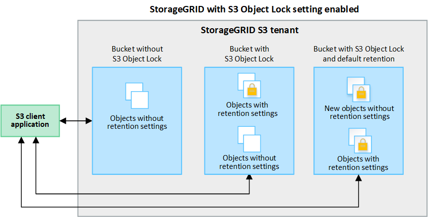

= Che cos'è il blocco oggetti S3?
:allow-uri-read: 

== Che cos'è il blocco oggetti S3?

La funzione blocco oggetti StorageGRID S3 è una soluzione di protezione degli oggetti equivalente a blocco oggetti S3 in Amazon Simple Storage Service (Amazon S3).

Come mostrato nella figura, quando l'impostazione globale S3 Object Lock è attivata per un sistema StorageGRID, un account tenant S3 può creare bucket con o senza S3 Object Lock abilitato. Se un bucket ha S3 Object Lock attivato, è necessario il controllo della versione del bucket e viene attivato automaticamente.

Se un bucket ha attivato il blocco oggetti S3, le applicazioni client S3 possono specificare le impostazioni di conservazione per qualsiasi versione di oggetto salvata in quel bucket.

Inoltre, un bucket con S3 Object Lock attivato può avere una modalità di conservazione e un periodo di conservazione predefiniti. Le impostazioni predefinite si applicano solo agli oggetti aggiunti al bucket senza le proprie impostazioni di conservazione.

=== Modalità di conservazione

La funzione blocco oggetti di StorageGRID S3 supporta due modalità di conservazione per applicare diversi livelli di protezione agli oggetti. Queste modalità equivalgono alle modalità di conservazione Amazon S3.

* In modalità compliance:
+
** L'oggetto non può essere eliminato fino a quando non viene raggiunta la data di conservazione.
** La conservazione dell'oggetto fino alla data odierna può essere aumentata, ma non può essere diminuita.
** La data di conservazione dell'oggetto non può essere rimossa fino al raggiungimento di tale data.

* In modalità governance:
+
** Gli utenti con autorizzazioni speciali possono utilizzare un'intestazione di bypass nelle richieste per modificare alcune impostazioni di conservazione.
** Questi utenti possono eliminare una versione dell'oggetto prima che venga raggiunta la data di conservazione.
** Questi utenti possono aumentare, ridurre o rimuovere il mantenimento di un oggetto fino ad oggi.

=== Impostazioni di conservazione per le versioni degli oggetti

Se viene creato un bucket con S3 Object Lock attivato, gli utenti possono utilizzare l'applicazione client S3 per specificare facoltativamente le seguenti impostazioni di conservazione per ogni oggetto aggiunto al bucket:

* *Modalità di conservazione*: Conformità o governance.
* *Mantieni-fino-data*: Se la data di conservazione di una versione dell'oggetto è futura, l'oggetto può essere recuperato, ma non può essere cancellato.
* *Conservazione legale*: L'applicazione di un blocco legale a una versione oggetto blocca immediatamente tale oggetto. Ad esempio, potrebbe essere necessario sospendere legalmente un oggetto correlato a un'indagine o a una controversia legale. Una conservazione a fini giudiziari non ha una data di scadenza, ma rimane attiva fino a quando non viene esplicitamente rimossa. Le conservazioni legali sono indipendenti dalla conservazione fino alla data odierna.
+

NOTE: Se un oggetto è sottoposto a un blocco legale, nessuno può eliminare l'oggetto, indipendentemente dalla modalità di conservazione.

+
Per ulteriori informazioni sulle impostazioni dell'oggetto, vedere link:../s3/use-s3-api-for-s3-object-lock.html["Utilizzare l'API REST S3 per configurare il blocco oggetti S3"].

=== Impostazione di conservazione predefinita per i bucket

Se viene creato un bucket con S3 Object Lock attivato, gli utenti possono specificare le seguenti impostazioni predefinite per il bucket:

* *Modalità di conservazione predefinita*: Conformità o governance.
* *Default Retention Period* (periodo di conservazione predefinito): Per quanto tempo le nuove versioni degli oggetti aggiunte a questo bucket devono essere conservate, a partire dal giorno in cui vengono aggiunte.

Le impostazioni predefinite del bucket si applicano solo ai nuovi oggetti che non dispongono di proprie impostazioni di conservazione. Gli oggetti bucket esistenti non vengono influenzati quando si aggiungono o si modificano queste impostazioni predefinite.

Vedere link:../tenant/creating-s3-bucket.html["Creare un bucket S3"] e. link:../tenant/update-default-retention-settings.html["Aggiorna la conservazione predefinita del blocco oggetti S3"].
