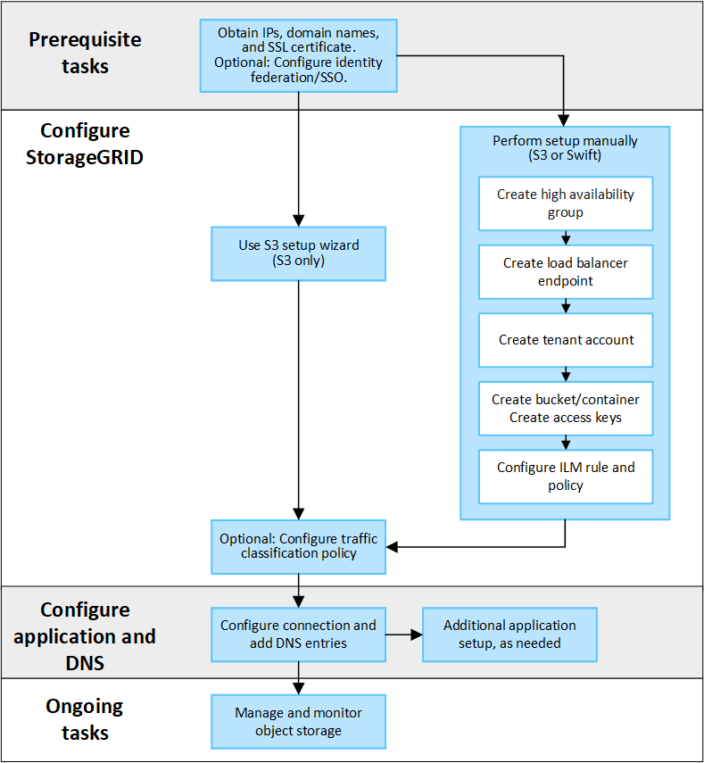

= Configurazione delle connessioni client S3 e Swift: Panoramica
:allow-uri-read: 
:icons: font
:imagesdir: ../media/

[role="lead"]
In qualità di amministratore di grid, gestisci le opzioni di configurazione che controllano il modo in cui le applicazioni client S3 e Swift si connettono al sistema StorageGRID per memorizzare e recuperare i dati.

NOTE: Il supporto per le applicazioni client Swift è stato obsoleto e verrà rimosso in una release futura.

== Workflow di configurazione

Come illustrato nel diagramma del flusso di lavoro, sono disponibili quattro passaggi principali per la connessione di StorageGRID a qualsiasi applicazione S3 o Swift:

. Eseguire attività preliminari in StorageGRID, in base al modo in cui l'applicazione client si connetterà a StorageGRID.
. Utilizzare StorageGRID per ottenere i valori necessari all'applicazione per connettersi alla griglia. È possibile utilizzare l'installazione guidata S3 o configurare manualmente ogni entità StorageGRID.
. Utilizzare l'applicazione S3 o Swift per completare la connessione a StorageGRID. Creare voci DNS per associare gli indirizzi IP ai nomi di dominio che si intende utilizzare.
. Eseguire attività in corso nell'applicazione e in StorageGRID per gestire e monitorare lo storage a oggetti nel tempo.

== Informazioni necessarie per collegare StorageGRID a un'applicazione client

Prima di poter collegare StorageGRID a un'applicazione client S3 o Swift, è necessario eseguire i passaggi di configurazione in StorageGRID e ottenere un determinato valore.

=== Di quali valori ho bisogno?

La seguente tabella mostra i valori da configurare in StorageGRID e i valori utilizzati dall'applicazione S3 o Swift e dal server DNS.

[cols="1a,1a,1a"]
|===
| Valore | Dove è configurato il valore | Dove viene utilizzato il valore 

 a| 
Indirizzi IP virtuali (VIP)
 a| 
StorageGRID > Gruppo ha
 a| 
Voce DNS

 a| 
Porta
 a| 
StorageGRID > endpoint del bilanciamento del carico
 a| 
Applicazione client

 a| 
Certificato SSL
 a| 
StorageGRID > endpoint del bilanciamento del carico
 a| 
Applicazione client

 a| 
Nome server (FQDN)
 a| 
StorageGRID > endpoint del bilanciamento del carico
 a| 
* Applicazione client
* Voce DNS

 a| 
ID chiave di accesso S3 e chiave di accesso segreta
 a| 
StorageGRID > tenant e bucket
 a| 
Applicazione client

 a| 
Nome bucket/container
 a| 
StorageGRID > tenant e bucket
 a| 
Applicazione client

|===

=== Come si ottengono questi valori?

In base alle proprie esigenze, è possibile effettuare una delle seguenti operazioni per ottenere le informazioni necessarie:

* *Utilizzare il link:use-s3-setup-wizard.html["Installazione guidata S3"]*. L'installazione guidata S3 consente di configurare rapidamente i valori richiesti in StorageGRID e di creare uno o due file da utilizzare per la configurazione dell'applicazione S3. La procedura guidata guida l'utente attraverso i passaggi richiesti e aiuta a verificare che le impostazioni siano conformi alle Best practice di StorageGRID.
+

NOTE: Se si sta configurando un'applicazione S3, si consiglia di utilizzare la procedura guidata di configurazione S3, a meno che non si sappiano requisiti speciali o l'implementazione richieda una personalizzazione significativa.

* *Utilizzare il link:../fabricpool/use-fabricpool-setup-wizard.html["Installazione guidata di FabricPool"]*. Analogamente all'installazione guidata di S3, l'installazione guidata di FabricPool consente di configurare rapidamente i valori richiesti e di creare un file da utilizzare quando si configura un livello cloud FabricPool in ONTAP.
+

NOTE: Se si prevede di utilizzare StorageGRID come sistema di storage a oggetti per un livello cloud FabricPool, si consiglia di utilizzare la procedura guidata di installazione di FabricPool, a meno che non si sappiano requisiti speciali o l'implementazione richieda una personalizzazione significativa.

* *Configurare gli elementi manualmente*. Se si sta effettuando la connessione a un'applicazione Swift (o si sta effettuando la connessione a un'applicazione S3 e si preferisce non utilizzare l'installazione guidata S3), è possibile ottenere i valori richiesti eseguendo la configurazione manualmente. Attenersi alla seguente procedura:
+
.. Configurare il gruppo ad alta disponibilità (ha) che si desidera utilizzare per l'applicazione S3 o Swift. Vedere link:configure-high-availability-group.html["Configurare i gruppi ad alta disponibilità"].
.. Creare l'endpoint del bilanciamento del carico che verrà utilizzato dall'applicazione S3 o Swift. Vedere link:configuring-load-balancer-endpoints.html["Configurare gli endpoint del bilanciamento del carico"].
.. Creare l'account tenant utilizzato dall'applicazione S3 o Swift. Vedere link:creating-tenant-account.html["Creare un account tenant"].
.. Per un tenant S3, accedere all'account tenant e generare un ID della chiave di accesso e una chiave di accesso segreta per ogni utente che accede all'applicazione. Vedere link:../tenant/creating-your-own-s3-access-keys.html["Creare le proprie chiavi di accesso"].
.. Creare uno o più bucket S3 o container Swift all'interno dell'account tenant. Per S3, vedere link:../tenant/creating-s3-bucket.html["Creare un bucket S3"]. Per Swift, utilizzare link:../swift/container-operations.html["INSERIRE la richiesta di container"].
.. Per aggiungere istruzioni di posizionamento specifiche per gli oggetti appartenenti al nuovo tenant o bucket/container, creare una nuova regola ILM e attivare un nuovo criterio ILM per utilizzare tale regola. Vedere link:../ilm/access-create-ilm-rule-wizard.html["Creare una regola ILM"] e. link:../ilm/creating-ilm-policy.html["Creare un criterio ILM"].

