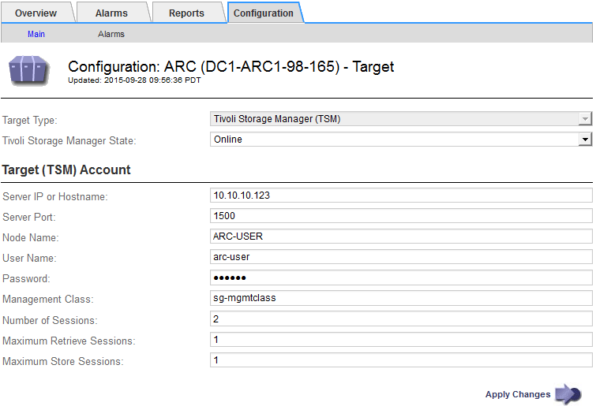

= Configurare le connessioni al middleware TSM
:allow-uri-read: 
:icons: font
:imagesdir: ../media/

[role="lead"]
Prima che il nodo di archiviazione possa comunicare con il middleware Tivoli Storage Manager (TSM), è necessario configurare diverse impostazioni.

.Prima di iniziare
* Hai effettuato l'accesso a Grid Manager utilizzando un link:../admin/web-browser-requirements.html["browser web supportato"].
* Lo hai fatto link:admin-group-permissions.html["autorizzazioni di accesso specifiche"].

.A proposito di questa attività
Fino a quando queste impostazioni non vengono configurate, il servizio ARC rimane in uno stato di allarme principale in quanto non è in grado di comunicare con Tivoli Storage Manager.

.Fasi
. Selezionare *SUPPORT* > *Tools* > *Grid topology*.
. Selezionare *_Archive Node_* > *ARC* > *Target*.
. Selezionare *Configurazione* > *principale*.
+

. Dall'elenco a discesa *Target Type* (tipo di destinazione), selezionare *Tivoli Storage Manager (TSM)*.
. Per lo stato di *Tivoli Storage Manager*, selezionare *Offline* per impedire il recupero dal server middleware TSM.
+
Per impostazione predefinita, lo stato di Tivoli Storage Manager è impostato su Online, il che significa che il nodo di archiviazione è in grado di recuperare i dati degli oggetti dal server middleware TSM.

. Completare le seguenti informazioni:
+
** *Server IP (IP server) o Hostname (Nome host)*: Specificare l'indirizzo IP o il nome di dominio completo del server middleware TSM utilizzato dal servizio ARC. L'indirizzo IP predefinito è 127.0.0.1.
** *Server Port* (porta server): Specificare il numero di porta sul server middleware TSM a cui si connetterà il servizio ARC. Il valore predefinito è 1500.
** *Node Name* (Nome nodo): Specificare il nome del nodo di archiviazione. Immettere il nome (arco‐utente) registrato sul server middleware TSM.
** *User Name* (Nome utente): Specificare il nome utente utilizzato dal servizio ARC per accedere al server TSM. Immettere il nome utente predefinito (Arc‐user) o l'utente amministrativo specificato per il nodo di archiviazione.
** *Password*: Specificare la password utilizzata dal servizio ARC per accedere al server TSM.
** *Classe di gestione*: Specificare la classe di gestione predefinita da utilizzare se non viene specificata una classe di gestione quando l'oggetto viene salvato nel sistema StorageGRID o se la classe di gestione specificata non viene definita nel server middleware TSM.
** *Numero di sessioni*: Specificare il numero di unità nastro sul server middleware TSM dedicate al nodo di archiviazione. Il nodo di archiviazione crea contemporaneamente un massimo di una sessione per punto di montaggio più un piccolo numero di sessioni aggiuntive (meno di cinque).
+
È necessario modificare questo valore in modo che sia uguale al valore impostato per MAXNUMMP (numero massimo di punti di montaggio) quando il nodo di archiviazione è stato registrato o aggiornato. (Nel comando register, il valore predefinito di MAXNUMMP utilizzato è 1, se non viene impostato alcun valore).

+
È inoltre necessario modificare il valore di MAXSESSIONS per il server TSM con un numero pari almeno al numero di sessioni impostato per il servizio ARC. Il valore predefinito di MAXSESSIONS sul server TSM è 25.

** *Numero massimo di sessioni di recupero*: Specificare il numero massimo di sessioni che il servizio ARC può aprire al server middleware TSM per le operazioni di recupero. Nella maggior parte dei casi, il valore appropriato è numero di sessioni meno numero massimo di sessioni del negozio. Se è necessario condividere un'unità a nastro per lo storage e il recupero, specificare un valore uguale al numero di sessioni.
** *Numero massimo di sessioni di archiviazione*: Specificare il numero massimo di sessioni simultanee che il servizio ARC può aprire al server middleware TSM per le operazioni di archiviazione.
+
Questo valore deve essere impostato su uno, tranne quando il sistema storage di archiviazione di destinazione è pieno e possono essere eseguiti solo i recuperi. Impostare questo valore su zero per utilizzare tutte le sessioni per i recuperi.

. Selezionare *Applica modifiche*.

