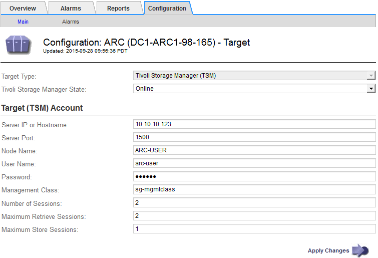

= Ottimizza un nodo di archiviazione per sessioni middleware TSM
:allow-uri-read: 
:icons: font
:imagesdir: ../media/

[role="lead"]
È possibile ottimizzare le prestazioni di un nodo di archiviazione che si connette a Tivoli Server Manager (TSM) configurando le sessioni del nodo di archiviazione.

.Prima di iniziare
* Hai effettuato l'accesso a Grid Manager utilizzando un link:../admin/web-browser-requirements.html["browser web supportato"].
* Lo hai fatto link:admin-group-permissions.html["autorizzazioni di accesso specifiche"].

.A proposito di questa attività
In genere, il numero di sessioni simultanee che il nodo di archiviazione ha aperto al server middleware TSM viene impostato sul numero di unità a nastro dedicate dal server TSM al nodo di archiviazione. Un'unità a nastro viene allocata per lo storage, mentre le altre vengono allocate per il recupero. Tuttavia, nelle situazioni in cui un nodo di storage viene ricostruito dalle copie del nodo di archivio o il nodo di archivio opera in modalità di sola lettura, è possibile ottimizzare le prestazioni del server TSM impostando il numero massimo di sessioni di recupero sullo stesso numero di sessioni simultanee. Il risultato è che tutti i dischi possono essere utilizzati contemporaneamente per il recupero e, al massimo, uno di questi dischi può essere utilizzato anche per lo storage, se applicabile.

.Fasi
. Selezionare *SUPPORT* > *Tools* > *Grid topology*.
. Selezionare *_Archive Node_* > *ARC* > *Target*.
. Selezionare *Configurazione* > *principale*.
. Modificare *numero massimo di sessioni di recupero* in modo che sia uguale a *numero di sessioni*.
+

. Selezionare *Applica modifiche*.

