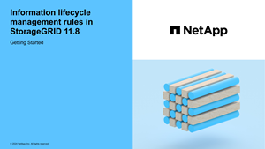

= Gestire gli oggetti con ILM
:allow-uri-read: 
:icons: font
:imagesdir: ../media/

[role="lead"]
Le regole di gestione del ciclo di vita delle informazioni (ILM, Information Lifecycle Management) contenute in un criterio ILM indicano a StorageGRID come creare e distribuire copie dei dati degli oggetti e come gestirle nel tempo.

== A proposito di queste istruzioni

La progettazione e l'implementazione di regole e politiche ILM richiedono un'attenta pianificazione. È necessario comprendere i requisiti operativi, la topologia del sistema StorageGRID, le esigenze di protezione degli oggetti e i tipi di storage disponibili. Quindi, è necessario determinare come si desidera copiare, distribuire e memorizzare diversi tipi di oggetti.

Seguire queste istruzioni per:

* Scopri di più su StorageGRID ILM, tra cui link:how-ilm-operates-throughout-objects-life.html["Come ILM opera per tutta la vita di un oggetto"].
* Scopri come configurare link:what-storage-pool-is.html["pool di storage"], link:what-cloud-storage-pool-is.html["Pool di cloud storage"], e. link:what-ilm-rule-is.html["Regole ILM"].
* Scopri come link:creating-ilm-policy.html["Creare, simulare e attivare un criterio ILM"] che proteggerà i dati degli oggetti in uno o più siti.
* Scopri come link:managing-objects-with-s3-object-lock.html["Gestire gli oggetti con S3 Object Lock"], Che aiuta a garantire che gli oggetti in specifici bucket S3 non vengano cancellati o sovrascritti per un determinato periodo di tempo.

== Scopri di più

Per ulteriori informazioni, consulta questi video:

* https://netapp.hosted.panopto.com/Panopto/Pages/Viewer.aspx?id=cb6294c0-e9cf-4d04-9d73-b0b901025b2f["Video: Regole di gestione del ciclo di vita delle informazioni in StorageGRID 11,8"^].
+
[link=https://netapp.hosted.panopto.com/Panopto/Pages/Viewer.aspx?id=cb6294c0-e9cf-4d04-9d73-b0b901025b2f]

* https://netapp.hosted.panopto.com/Panopto/Pages/Viewer.aspx?id=fb967139-e032-49ef-b529-b0ba00a7f0ad["Video: Politiche di gestione del ciclo di vita delle informazioni in StorageGRID 11,8"^]
+
[link=https://netapp.hosted.panopto.com/Panopto/Pages/Viewer.aspx?id=fb967139-e032-49ef-b529-b0ba00a7f0ad]
image::../media/video-screenshot-ilm-policies-118.png[Video: Politiche di gestione del ciclo di vita delle informazioni in StorageGRID 11,8]

