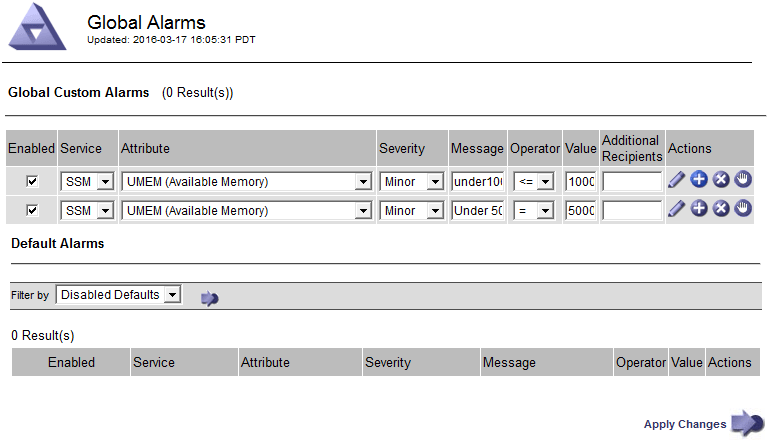
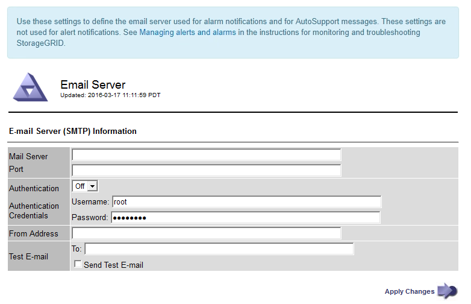
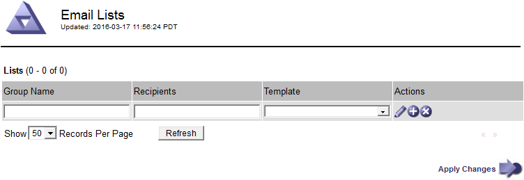

= Gestire gli allarmi (sistema legacy)
:allow-uri-read: 
:icons: font
:imagesdir: ../media/

[role="lead"]
Il sistema di allarme StorageGRID è il sistema legacy utilizzato per identificare i punti di errore che talvolta si verificano durante il normale funzionamento.

NOTE: Mentre il sistema di allarme legacy continua a essere supportato, il sistema di allarme offre vantaggi significativi ed è più facile da utilizzare.

== Classi di allarme (sistema legacy)

Un allarme legacy può appartenere a una delle due classi di allarme che si escludono a vicenda.

* Gli allarmi predefiniti vengono forniti con ogni sistema StorageGRID e non possono essere modificati. Tuttavia, è possibile disattivare gli allarmi predefiniti o ignorarli definendo gli allarmi personalizzati globali.
* Gli allarmi personalizzati globali monitorano lo stato di tutti i servizi di un determinato tipo nel sistema StorageGRID. È possibile creare un allarme Global Custom per ignorare un allarme Default. È inoltre possibile creare un nuovo allarme Global Custom. Ciò può essere utile per monitorare qualsiasi condizione personalizzata del sistema StorageGRID.

== Logica di attivazione degli allarmi (sistema legacy)

Un allarme legacy viene attivato quando un attributo StorageGRID raggiunge un valore di soglia che viene valutato come true rispetto a una combinazione di classe di allarme (predefinita o personalizzata globale) e livello di gravità dell'allarme.

[cols="1a,1a,1a,3a"]
|===
| Icona | Colore | Severità degli allarmi | Significato 

 a| 
image:../media/icon_alarm_yellow_notice.gif["icona quadrata gialla"]
 a| 
Giallo
 a| 
Avviso
 a| 
Il nodo è connesso alla rete, ma esiste una condizione insolita che non influisce sulle normali operazioni.

 a| 
image:../media/icon_alert_yellow_minor.png["icona a forma di diamante arancione chiaro"]
 a| 
Arancione chiaro
 a| 
Minore
 a| 
Il nodo è collegato alla rete, ma esiste una condizione anomala che potrebbe influire sul funzionamento in futuro. È necessario indagare per evitare l'escalation.

 a| 
image:../media/icon_alert_orange_major.png["icona a forma di diamante arancione scuro"]
 a| 
Arancione scuro
 a| 
Maggiore
 a| 
Il nodo è collegato alla rete, ma esiste una condizione anomala che attualmente influisce sul funzionamento. Ciò richiede una rapida attenzione per evitare l'escalation.

 a| 
image:../media/icon_alert_red_critical.png["icona x rossa"]
 a| 
Rosso
 a| 
Critico
 a| 
Il nodo è connesso alla rete, ma esiste una condizione anomala che ha interrotto le normali operazioni. Il problema deve essere risolto immediatamente.

|===
È possibile impostare la severità dell'allarme e il valore di soglia corrispondente per ogni attributo numerico. Il servizio NMS su ciascun nodo di amministrazione monitora continuamente i valori degli attributi correnti in base alle soglie configurate. Quando viene attivato un allarme, viene inviata una notifica a tutto il personale designato.

Si noti che un livello di severità normale non attiva un allarme.

I valori degli attributi vengono valutati in base all'elenco di allarmi abilitati definito per tale attributo. L'elenco degli allarmi viene controllato nel seguente ordine per individuare la prima classe di allarme con un allarme definito e attivato per l'attributo:

. Allarmi personalizzati globali con livelli di interruzione degli allarmi da critici a avvisi.
. Allarmi predefiniti con livelli di gravità degli allarmi da critico a Avviso.

Dopo che un allarme abilitato per un attributo viene trovato nella classe di allarme superiore, il servizio NMS valuta solo all'interno di tale classe. Il servizio NMS non valuterà le altre classi con priorità inferiore. In altri termini, se per un attributo è attivato un allarme Global Custom, il servizio NMS valuta solo il valore dell'attributo rispetto agli allarmi Global Custom. Gli allarmi predefiniti non vengono valutati. Pertanto, un allarme predefinito abilitato per un attributo può soddisfare i criteri necessari per attivare un allarme, ma non verrà attivato perché è attivato un allarme personalizzato globale (che non soddisfa i criteri specificati) per lo stesso attributo. Non viene attivato alcun allarme e non viene inviata alcuna notifica.

=== Esempio di attivazione degli allarmi

È possibile utilizzare questo esempio per comprendere come vengono attivati gli allarmi Global Custom e Default.

Nell'esempio seguente, un attributo ha un allarme Global Custom e un allarme Default definiti e attivati come mostrato nella tabella seguente.

[cols="1a,2a,2a"]
|===
|  | Soglia di allarme Global Custom (abilitata) | Soglia di allarme predefinita (attivata) 

 a| 
Avviso
 a| 
>= 1500
 a| 
>= 1000

 a| 
Minore
 a| 
>= 15.000
 a| 
>= 1000

 a| 
Maggiore
 a| 
>=150,000
 a| 
>= 250.000

|===
Se l'attributo viene valutato quando il suo valore è 1000, non viene attivato alcun allarme e non viene inviata alcuna notifica.

L'allarme Global Custom ha la precedenza sull'allarme Default. Un valore di 1000 non raggiunge il valore di soglia di alcun livello di severità per l'allarme Global Custom. Di conseguenza, il livello di allarme viene valutato come normale.

Dopo lo scenario precedente, se l'allarme Global Custom è disattivato, non cambia nulla. Il valore dell'attributo deve essere rivalutato prima che venga attivato un nuovo livello di allarme.

Se l'allarme Global Custom è disattivato, quando il valore dell'attributo viene rivalutato, il valore dell'attributo viene valutato in base ai valori di soglia per l'allarme Default. Il livello di allarme attiva un allarme di livello Notice e viene inviata una notifica via email al personale designato.

=== Allarmi della stessa severità

Se due allarmi personalizzati globali per lo stesso attributo hanno lo stesso livello di gravità, gli allarmi vengono valutati con una priorità "dall'alto verso il basso".

Ad esempio, se l'UMEM scende a 50 MB, viene attivato il primo allarme (= 50000000), ma non quello sottostante (<=100000000).

image::../media/alarm_order.gif[Esempio di allarme personalizzato globale]

Se l'ordine viene invertito, quando l'UMEM scende a 100 MB, viene attivato il primo allarme (<=100000000), ma non quello sottostante (= 50000000).

=== Notifiche

Una notifica indica il verificarsi di un allarme o il cambiamento di stato di un servizio. Le notifiche di allarme possono essere inviate tramite e-mail o SNMP.

Per evitare l'invio di più allarmi e notifiche quando viene raggiunto un valore di soglia di allarme, la gravità dell'allarme viene controllata in base alla gravità corrente dell'attributo. Se non si verificano modifiche, non viene intrapresa alcuna azione. Ciò significa che mentre il servizio NMS continua a monitorare il sistema, genera un allarme e invia notifiche solo la prima volta che rileva una condizione di allarme per un attributo. Se viene raggiunta e rilevata una nuova soglia di valore per l'attributo, la gravità dell'allarme cambia e viene inviata una nuova notifica. Gli allarmi vengono cancellati quando le condizioni tornano al livello normale.

Il valore di attivazione visualizzato nella notifica di uno stato di allarme viene arrotondato a tre cifre decimali. Pertanto, un valore di attributo 1.9999 attiva un allarme la cui soglia è inferiore a (<) 2.0, anche se la notifica di allarme mostra il valore di attivazione come 2.0.

=== Nuovi servizi

Man mano che i nuovi servizi vengono aggiunti tramite l'aggiunta di nuovi nodi o siti della griglia, ereditano gli allarmi predefiniti e gli allarmi personalizzati globali.

=== Allarmi e tabelle

Gli attributi degli allarmi visualizzati nelle tabelle possono essere disattivati a livello di sistema. Non è possibile disattivare gli allarmi per singole righe di una tabella.

Ad esempio, la tabella seguente mostra due allarmi VMFI (Critical Entries Available). (Selezionare *SUPPORT* > *Tools* > *Grid topology*. Quindi, selezionare *_Storage Node_* > *SSM* > *Resources*.)

È possibile disattivare l'allarme VMFI in modo che l'allarme VMFI di livello critico non venga attivato (entrambi gli allarmi attualmente critici vengono visualizzati in verde nella tabella); Tuttavia, non è possibile disattivare un singolo allarme in una riga di tabella in modo che un allarme VMFI venga visualizzato come allarme di livello critico mentre l'altro rimane verde.

image::../media/disabling_alarms.gif[Pagina Volumes (volumi) che mostra gli allarmi critici]

== Riconoscere gli allarmi correnti (sistema precedente)

Gli allarmi legacy vengono attivati quando gli attributi di sistema raggiungono i valori di soglia degli allarmi. Se si desidera ridurre o cancellare l'elenco degli allarmi legacy, è possibile confermarli.

.Prima di iniziare
* È necessario accedere a Grid Manager utilizzando un link:../admin/web-browser-requirements.html["browser web supportato"].
* È necessario disporre dell'autorizzazione di riconoscimento degli allarmi.

.A proposito di questa attività
Poiché il sistema di allarme legacy continua a essere supportato, l'elenco degli allarmi legacy nella pagina Allarmi correnti aumenta ogni volta che si verifica un nuovo allarme. In genere, è possibile ignorare gli allarmi (in quanto forniscono una migliore visualizzazione del sistema) oppure riconoscere gli allarmi.

NOTE: In alternativa, una volta eseguita la transizione completa al sistema di allerta, è possibile disattivare ciascun allarme legacy per evitare che venga attivato e aggiunto al numero di allarmi legacy.

Quando si riconosce un allarme, questo non viene più elencato nella pagina Current Alarms (Allarmi correnti) di Grid Manager, a meno che l'allarme non venga attivato al livello di severità successivo o venga risolto e riattivato.

NOTE: Mentre il sistema di allarme legacy continua a essere supportato, il sistema di allarme offre vantaggi significativi ed è più facile da utilizzare.

.Fasi
. Selezionare *SUPPORTO* > *Allarmi (legacy)* > *Allarmi correnti*.
+
image::../media/current_alarms_page.png[Pagina Allarmi correnti]

. Selezionare il nome del servizio nella tabella.
+
Viene visualizzata la scheda Allarmi per il servizio selezionato (*SUPPORT* > *Tools* > *Grid topology* > *_Grid Node_* > *_Service_* > *Alarms*).

+
image::../media/alarms_acknowledging.png[Conferma degli allarmi]

. Selezionare la casella di controllo *Acknowledge* (Conferma) per l'allarme e fare clic su *Apply Changes* (Applica modifiche).
+
L'allarme non viene più visualizzato nella dashboard o nella pagina Allarmi correnti.

+

NOTE: Quando si riconosce un allarme, la conferma non viene copiata in altri nodi di amministrazione. Per questo motivo, se si visualizza la dashboard da un altro nodo di amministrazione, è possibile continuare a visualizzare l'allarme attivo.

. Se necessario, visualizzare gli allarmi confermati.
+
.. Selezionare *SUPPORTO* > *Allarmi (legacy)* > *Allarmi correnti*.
.. Selezionare *Mostra allarmi confermati*.
+
Vengono visualizzati tutti gli allarmi confermati.

+
image::../media/current_alarms_page_show_acknowledged.png[La pagina Allarmi correnti mostra gli allarmi confermati]

== Visualizza allarmi predefiniti (sistema legacy)

È possibile visualizzare l'elenco di tutti gli allarmi legacy predefiniti.

.Prima di iniziare
* È necessario accedere a Grid Manager utilizzando un link:../admin/web-browser-requirements.html["browser web supportato"].
* Lo hai fatto link:../admin/admin-group-permissions.html["autorizzazioni di accesso specifiche"].

NOTE: Mentre il sistema di allarme legacy continua a essere supportato, il sistema di allarme offre vantaggi significativi ed è più facile da utilizzare.

.Fasi
. Selezionare *SUPPORTO* > *Allarmi (legacy)* > *Allarmi globali*.
. Per Filtra per, selezionare *Codice attributo* o *Nome attributo*.
. Per uguale, inserire un asterisco: `*`
. Fare clic sulla freccia image:../media/icon_nms_right_arrow.gif["Icona a forma di freccia"] Oppure premere *Invio*.
+
Vengono elencati tutti gli allarmi predefiniti.

+
image::../media/global_alarms.gif[Pagina Global Alarms]

== Rivedere la cronologia degli allarmi e la frequenza degli allarmi (sistema precedente)

Durante la risoluzione di un problema, è possibile verificare la frequenza con cui un allarme legacy è stato attivato in passato.

.Prima di iniziare
* È necessario accedere a Grid Manager utilizzando un link:../admin/web-browser-requirements.html["browser web supportato"].
* Lo hai fatto link:../admin/admin-group-permissions.html["autorizzazioni di accesso specifiche"].

NOTE: Mentre il sistema di allarme legacy continua a essere supportato, il sistema di allarme offre vantaggi significativi ed è più facile da utilizzare.

.Fasi
. Seguire questa procedura per ottenere un elenco di tutti gli allarmi attivati in un determinato periodo di tempo.
+
.. Selezionare *SUPPORTO* > *Allarmi (legacy)* > *Allarmi storici*.
.. Effettuare una delle seguenti operazioni:
+
*** Fare clic su uno dei periodi di tempo.
*** Immettere un intervallo personalizzato e fare clic su *Custom Query* (Query personalizzata).

. Seguire questa procedura per scoprire la frequenza con cui sono stati attivati gli allarmi per un determinato attributo.
+
.. Selezionare *SUPPORT* > *Tools* > *Grid topology*.
.. Selezionare *_grid node_* > *_service o component_* > *Alarms* > *History*.
.. Selezionare l'attributo dall'elenco.
.. Effettuare una delle seguenti operazioni:
+
*** Fare clic su uno dei periodi di tempo.
*** Immettere un intervallo personalizzato e fare clic su *Custom Query* (Query personalizzata).
+
Gli allarmi sono elencati in ordine cronologico inverso.

.. Per tornare al modulo di richiesta della cronologia degli allarmi, fare clic su *Cronologia*.

== Creazione di allarmi personalizzati globali (sistema legacy)

È possibile che siano stati utilizzati gli allarmi Global Custom per il sistema legacy per soddisfare specifici requisiti di monitoraggio. Gli allarmi Global Custom potrebbero avere livelli di allarme che prevalgono sugli allarmi predefiniti oppure potrebbero monitorare attributi che non hanno un allarme predefinito.

.Prima di iniziare
* È necessario accedere a Grid Manager utilizzando un link:../admin/web-browser-requirements.html["browser web supportato"].
* Lo hai fatto link:../admin/admin-group-permissions.html["autorizzazioni di accesso specifiche"].

NOTE: Mentre il sistema di allarme legacy continua a essere supportato, il sistema di allarme offre vantaggi significativi ed è più facile da utilizzare.

Gli allarmi Global Custom prevalgono sugli allarmi predefiniti. Non modificare i valori di allarme predefiniti, a meno che non sia assolutamente necessario. Modificando gli allarmi predefiniti, si corre il rischio di nascondere problemi che potrebbero altrimenti attivare un allarme.

NOTE: Prestare attenzione se si modificano le impostazioni della sveglia. Ad esempio, se si aumenta il valore di soglia per un allarme, potrebbe non essere rilevato un problema sottostante. Discutere le modifiche proposte con il supporto tecnico prima di modificare l'impostazione di un allarme.

.Fasi
. Selezionare *SUPPORTO* > *Allarmi (legacy)* > *Allarmi globali*.
. Aggiungere una nuova riga alla tabella Global Custom Alarms (Allarmi personalizzati globali):
+
** Per aggiungere un nuovo allarme, fare clic su *Edit* (Modifica) image:../media/icon_nms_edit.gif["icona edit (modifica)"] (Se si tratta della prima voce) o *Insert* image:../media/icon_nms_insert.gif["inserire l'icona"].
+
image::../media/global_custom_alarms.gif[Pagina Global Alarms]

** Per modificare un allarme predefinito, cercare l'allarme predefinito.
+
... In Filtra per, selezionare *Codice attributo* o *Nome attributo*.
... Digitare una stringa di ricerca.
+
Specificare quattro caratteri o utilizzare caratteri jolly (Ad esempio, A???? O AB*). Gli asterischi (*) rappresentano più caratteri e punti interrogativi (?) rappresenta un singolo carattere.

... Fare clic sulla freccia image:../media/icon_nms_right_arrow.gif["icona freccia destra"]Oppure premere *Invio*.
... Nell'elenco dei risultati, fare clic su *Copia* image:../media/icon_nms_copy.gif["icona di copia"] accanto all'allarme che si desidera modificare.
+
L'allarme predefinito viene copiato nella tabella Global Custom Alarms (Allarmi personalizzati globali).

. Apportare le modifiche necessarie alle impostazioni degli allarmi Global Custom:
+
[cols="1a,2a"]
|===
| Intestazione | Descrizione 

 a| 
Attivato
 a| 
Selezionare o deselezionare la casella di controllo per attivare o disattivare l'allarme.

 a| 
Attributo
 a| 
Selezionare il nome e il codice dell'attributo monitorato dall'elenco di tutti gli attributi applicabili al servizio o al componente selezionato.
Per visualizzare le informazioni relative all'attributo, fare clic su *Info* image:../media/icon_nms_info.gif["icona delle informazioni"] accanto al nome dell'attributo.

 a| 
Severità
 a| 
L'icona e il testo che indicano il livello dell'allarme.

 a| 
Messaggio
 a| 
Il motivo dell'allarme (connessione persa, spazio di storage inferiore al 10% e così via).

 a| 
Operatore
 a| 
Operatori per il test del valore dell'attributo corrente rispetto alla soglia del valore:

** = uguale
** > maggiore di
** < meno di
** >= maggiore o uguale a.
** <= minore o uguale a.
** ≠ non uguale a.

 a| 
Valore
 a| 
Il valore di soglia dell'allarme utilizzato per eseguire il test in base al valore effettivo dell'attributo utilizzando l'operatore.
La voce può essere un singolo numero, un intervallo di numeri specificato con due punti (1:3) o un elenco di numeri e intervalli delimitati da virgole.

 a| 
Destinatari aggiuntivi
 a| 
Un elenco supplementare di indirizzi e-mail da notificare quando viene attivato l'allarme. Oltre alla mailing list configurata nella pagina *Allarmi* > *Configurazione e-mail*. Gli elenchi sono delimitati da virgole.

*Nota:* le mailing list richiedono la configurazione del server SMTP per funzionare. Prima di aggiungere mailing list, verificare che SMTP sia configurato.
Le notifiche per gli allarmi personalizzati possono ignorare le notifiche degli allarmi Global Custom o Default.

 a| 
Azioni
 a| 
Pulsanti di controllo per:    image:../media/icon_nms_edit.gif["icona edit (modifica)"] Modificare una riga

+
image:../media/icon_nms_insert.gif["inserire l'icona"] Inserire una riga

+
image:../media/icon_nms_delete.gif["icona elimina"] Eliminare una riga

+
image:../media/icon_nms_drag_and_drop.gif["trascinare l'icona"] Trascinare una riga verso l'alto o verso il basso

+
image:../media/icon_nms_copy.gif["icona di copia"] Copiare una riga

|===
. Fare clic su *Applica modifiche*.

== Disattivazione degli allarmi (sistema legacy)

Gli allarmi nel sistema di allarme legacy sono attivati per impostazione predefinita, ma è possibile disattivarli che non sono necessari. È inoltre possibile disattivare gli allarmi legacy dopo la completa transizione al nuovo sistema di allerta.

NOTE: Mentre il sistema di allarme legacy continua a essere supportato, il sistema di allarme offre vantaggi significativi ed è più facile da utilizzare.

=== Disattivazione di un allarme predefinito (sistema legacy)

È possibile disattivare uno degli allarmi predefiniti legacy per l'intero sistema.

.Prima di iniziare
* È necessario accedere a Grid Manager utilizzando un link:../admin/web-browser-requirements.html["browser web supportato"].
* Lo hai fatto link:../admin/admin-group-permissions.html["autorizzazioni di accesso specifiche"].

.A proposito di questa attività
La disattivazione di un allarme per un attributo per il quale è attualmente attivato un allarme non cancella l'allarme corrente. L'allarme verrà disattivato al successivo superamento della soglia di allarme da parte dell'attributo oppure sarà possibile eliminare l'allarme attivato.

NOTE: Non disattivare gli allarmi legacy fino a quando non si è passati completamente al nuovo sistema di allarme. In caso contrario, potrebbe non essere possibile rilevare un problema sottostante fino a quando non si è impedito il completamento di un'operazione critica.

.Fasi
. Selezionare *SUPPORTO* > *Allarmi (legacy)* > *Allarmi globali*.
. Cercare l'allarme predefinito da disattivare.
+
.. Nella sezione Allarmi predefiniti, selezionare *Filtra per* > *Codice attributo* o *Nome attributo*.
.. Digitare una stringa di ricerca.
+
Specificare quattro caratteri o utilizzare caratteri jolly (Ad esempio, A???? O AB*). Gli asterischi (*) rappresentano più caratteri e punti interrogativi (?) rappresenta un singolo carattere.

.. Fare clic sulla freccia image:../media/icon_nms_right_arrow.gif["icona freccia destra"]Oppure premere *Invio*.

+

NOTE: Selezionando *Disabled Defaults* (Impostazioni predefinite disabilitate) viene visualizzato un elenco di tutti gli allarmi predefiniti attualmente disattivati.

. Nella tabella dei risultati della ricerca, fare clic sull'icona Modifica image:../media/icon_nms_edit.gif["icona edit (modifica)"] per la sveglia che si desidera disattivare.
+
image::../media/disable_default_alarm_global.gif[Pagina Global Alarms]

+
La casella di controllo *Enabled* dell'allarme selezionato diventa attiva.

. Deselezionare la casella di controllo *Enabled*.
. Fare clic su *Applica modifiche*.
+
L'allarme predefinito è disattivato.

=== Disattiva allarmi Global Custom (sistema legacy)

È possibile disattivare un allarme Global Custom legacy per l'intero sistema.

.Prima di iniziare
* È necessario accedere a Grid Manager utilizzando un link:../admin/web-browser-requirements.html["browser web supportato"].
* Lo hai fatto link:../admin/admin-group-permissions.html["autorizzazioni di accesso specifiche"].

.A proposito di questa attività
La disattivazione di un allarme per un attributo per il quale è attualmente attivato un allarme non cancella l'allarme corrente. L'allarme verrà disattivato al successivo superamento della soglia di allarme da parte dell'attributo oppure sarà possibile eliminare l'allarme attivato.

.Fasi
. Selezionare *SUPPORTO* > *Allarmi (legacy)* > *Allarmi globali*.
. Nella tabella Global Custom Alarms (Allarmi personalizzati globali), fare clic su *Edit* (Modifica) image:../media/icon_nms_edit.gif["icona edit (modifica)"] accanto all'allarme che si desidera disattivare.
. Deselezionare la casella di controllo *Enabled*.
+
image::../media/disable_global_custom_alarm.gif[Pagina Global Alarms]

. Fare clic su *Applica modifiche*.
+
L'allarme Global Custom è disattivato.

=== Cancellazione degli allarmi attivati (sistema precedente)

Se viene attivato un allarme legacy, è possibile cancellarlo invece di confermarlo.

.Prima di iniziare
* È necessario disporre di ``Passwords.txt`` file.

La disattivazione di un allarme per un attributo per il quale è attualmente attivato un allarme non cancella l'allarme. L'allarme verrà disattivato alla successiva modifica dell'attributo. È possibile riconoscere l'allarme oppure, se si desidera annullare immediatamente l'allarme anziché attendere la modifica del valore dell'attributo (con conseguente modifica dello stato dell'allarme), è possibile annullare l'allarme attivato. Questa operazione potrebbe essere utile se si desidera eliminare immediatamente un allarme in relazione a un attributo il cui valore non cambia spesso (ad esempio, gli attributi di stato).

. Disattiva l'allarme.
. Accedere al nodo di amministrazione principale:
+
.. Immettere il seguente comando: `_ssh admin@primary_Admin_Node_IP_`
.. Immettere la password elencata in ``Passwords.txt`` file.
.. Immettere il seguente comando per passare a root: `su -`
.. Immettere la password elencata in `Passwords.txt` file.
+
Una volta effettuato l'accesso come root, il prompt cambia da `$` a. `#`.

. Riavviare il servizio NMS: `service nms restart`
. Disconnettersi dal nodo di amministrazione: `exit`
+
L'allarme viene cancellato.

== Configurazione delle notifiche per gli allarmi (sistema legacy)

Il sistema StorageGRID può inviare automaticamente e-mail e. link:using-snmp-monitoring.html["Notifiche SNMP"] quando viene attivato un allarme o quando cambia lo stato di servizio.

Per impostazione predefinita, le notifiche e-mail di allarme non vengono inviate. Per le notifiche e-mail, è necessario configurare il server e-mail e specificare i destinatari. Per le notifiche SNMP, è necessario configurare l'agente SNMP.

=== Tipi di notifiche di allarme (sistema legacy)

Quando viene attivato un allarme legacy, il sistema StorageGRID invia due tipi di notifiche di allarme: Livello di severità e stato del servizio.

==== Notifiche del livello di severità

Quando viene attivato un allarme legacy a un livello di severità selezionato, viene inviata una notifica via email:

* Avviso
* Minore
* Maggiore
* Critico

Una mailing list riceve tutte le notifiche relative all'allarme per la severità selezionata. Quando l'allarme esce dal livello di allarme, viene inviata una notifica tramite risoluzione o immissione di un livello di gravità diverso.

==== Notifiche dello stato del servizio

Viene inviata una notifica dello stato del servizio quando un servizio (ad esempio, il servizio LDR o il servizio NMS) entra nello stato del servizio selezionato e lascia lo stato del servizio selezionato. Le notifiche dello stato del servizio vengono inviate quando un servizio entra o lascia uno dei seguenti stati del servizio:

* Sconosciuto
* Amministrazione non disponibile

Una mailing list riceve tutte le notifiche relative ai cambiamenti nello stato selezionato.

=== Configurare le impostazioni del server di posta elettronica per gli allarmi (sistema legacy)

Se si desidera che StorageGRID invii notifiche e-mail quando viene attivato un allarme legacy, è necessario specificare le impostazioni del server di posta SMTP. Il sistema StorageGRID invia solo e-mail; non può ricevere e-mail.

.Prima di iniziare
* È necessario accedere a Grid Manager utilizzando un link:../admin/web-browser-requirements.html["browser web supportato"].
* Lo hai fatto link:../admin/admin-group-permissions.html["autorizzazioni di accesso specifiche"].

.A proposito di questa attività
Utilizzare queste impostazioni per definire il server SMTP utilizzato per le notifiche e-mail di allarme legacy e i messaggi e-mail AutoSupport. Queste impostazioni non vengono utilizzate per le notifiche degli avvisi.

NOTE: Se si utilizza SMTP come protocollo per i pacchetti AutoSupport, è possibile che sia già stato configurato un server di posta SMTP. Lo stesso server SMTP viene utilizzato per le notifiche e-mail di allarme, pertanto è possibile saltare questa procedura. Vedere link:../admin/index.html["Istruzioni per l'amministrazione di StorageGRID"].

SMTP è l'unico protocollo supportato per l'invio di e-mail.

.Fasi
. Selezionare *SUPPORT* > *Alarms (legacy)* > *Legacy email setup*.
. Dal menu e-mail, selezionare *Server*.
+
Viene visualizzata la pagina Server di posta elettronica. Questa pagina viene utilizzata anche per configurare il server di posta elettronica per i pacchetti AutoSupport.

+

. Aggiungere le seguenti impostazioni del server di posta SMTP:
+
[cols="1a,2a"]
|===
| Elemento | Descrizione 

 a| 
Server di posta
 a| 
Indirizzo IP del server di posta SMTP. È possibile inserire un nome host anziché un indirizzo IP se in precedenza sono state configurate le impostazioni DNS nel nodo di amministrazione.

 a| 
Porta
 a| 
Numero di porta per accedere al server di posta SMTP.

 a| 
Autenticazione
 a| 
Consente l'autenticazione del server di posta SMTP. Per impostazione predefinita, l'autenticazione è disattivata.

 a| 
Credenziali di autenticazione
 a| 
Nome utente e password del server di posta SMTP. Se l'opzione Authentication (autenticazione) è impostata su on, è necessario fornire un nome utente e una password per accedere al server di posta SMTP.

|===
. Sotto *Indirizzo mittente*, immettere un indirizzo e-mail valido che il server SMTP riconoscerà come indirizzo e-mail di invio. Indirizzo e-mail ufficiale da cui viene inviato il messaggio e-mail.
. Facoltativamente, inviare un'e-mail di prova per confermare che le impostazioni del server di posta SMTP sono corrette.
+
.. Nella casella *e-mail di prova* > *a*, aggiungere uno o più indirizzi ai quali è possibile accedere.
+
È possibile inserire un singolo indirizzo e-mail o un elenco di indirizzi e-mail delimitati da virgole. Poiché il servizio NMS non conferma l'esito positivo o negativo dell'invio di un'e-mail di prova, è necessario controllare la posta in arrivo del destinatario del test.

.. Selezionare *Invia e-mail di prova*.

. Fare clic su *Applica modifiche*.
+
Le impostazioni del server di posta SMTP vengono salvate. Se sono state inserite informazioni per un'e-mail di prova, tale e-mail viene inviata. I messaggi di posta elettronica di prova vengono inviati immediatamente al server di posta e non attraverso la coda delle notifiche. In un sistema con più nodi di amministrazione, ogni nodo di amministrazione invia un'email. La ricezione dell'email di prova conferma che le impostazioni del server di posta SMTP sono corrette e che il servizio NMS si sta connettendo correttamente al server di posta. Un problema di connessione tra il servizio NMS e il server di posta attiva l'allarme MIN legacy (NMS Notification Status) al livello di gravità minore.

=== Creazione di modelli e-mail di allarme (sistema legacy)

I modelli e-mail consentono di personalizzare l'intestazione, il piè di pagina e l'oggetto di una notifica e-mail di allarme legacy. È possibile utilizzare i modelli e-mail per inviare notifiche univoche contenenti lo stesso corpo del testo a diverse mailing list.

.Prima di iniziare
* È necessario accedere a Grid Manager utilizzando un link:../admin/web-browser-requirements.html["browser web supportato"].
* Lo hai fatto link:../admin/admin-group-permissions.html["autorizzazioni di accesso specifiche"].

.A proposito di questa attività
Utilizzare queste impostazioni per definire i modelli e-mail utilizzati per le notifiche di allarme legacy. Queste impostazioni non vengono utilizzate per le notifiche degli avvisi.

Diverse mailing list potrebbero richiedere informazioni di contatto diverse. I modelli non includono il corpo del messaggio e-mail.

.Fasi
. Selezionare *SUPPORT* > *Alarms (legacy)* > *Legacy email setup*.
. Dal menu e-mail, selezionare *modelli*.
. Fare clic su *Edit* (Modifica) image:../media/icon_nms_edit.gif["icona edit (modifica)"] (O *Inserisci* image:../media/icon_nms_insert.gif["inserire l'icona"] se questo non è il primo modello).
+

. Nella nuova riga aggiungere quanto segue:
+
[cols="1a,2a"]
|===
| Elemento | Descrizione 

 a| 
Nome modello
 a| 
Nome univoco utilizzato per identificare il modello. I nomi dei modelli non possono essere duplicati.

 a| 
Prefisso soggetto
 a| 
Opzionale. Prefisso che verrà visualizzato all'inizio dell'oggetto dell'e-mail. I prefissi possono essere utilizzati per configurare facilmente i filtri e-mail e organizzare le notifiche.

 a| 
Intestazione
 a| 
Opzionale. Testo dell'intestazione visualizzato all'inizio del corpo del messaggio di posta elettronica. Il testo dell'intestazione può essere utilizzato per anteporre al contenuto del messaggio di posta elettronica informazioni quali nome e indirizzo della società.

 a| 
Piè di pagina
 a| 
Opzionale. Testo a piè di pagina visualizzato alla fine del corpo del messaggio di posta elettronica. Il testo a piè di pagina può essere utilizzato per chiudere il messaggio e-mail con informazioni di promemoria come un numero di telefono di un contatto o un collegamento a un sito Web.

|===
. Fare clic su *Applica modifiche*.
+
Viene aggiunto un nuovo modello per le notifiche.

=== Creare mailing list per le notifiche di allarme (sistema legacy)

Le mailing list consentono di notificare ai destinatari quando viene attivato un allarme legacy o quando cambia lo stato di un servizio. È necessario creare almeno una mailing list prima di poter inviare notifiche di allarme via email. Per inviare una notifica a un singolo destinatario, creare una mailing list con un indirizzo e-mail.

.Prima di iniziare
* È necessario accedere a Grid Manager utilizzando un link:../admin/web-browser-requirements.html["browser web supportato"].
* Lo hai fatto link:../admin/admin-group-permissions.html["autorizzazioni di accesso specifiche"].
* Se si desidera specificare un modello e-mail per la mailing list (intestazione personalizzata, piè di pagina e oggetto), è necessario aver già creato il modello.

.A proposito di questa attività
Utilizzare queste impostazioni per definire le mailing list utilizzate per le notifiche e-mail di allarme legacy. Queste impostazioni non vengono utilizzate per le notifiche degli avvisi.

.Fasi
. Selezionare *SUPPORT* > *Alarms (legacy)* > *Legacy email setup*.
. Dal menu e-mail, selezionare *Liste*.
. Fare clic su *Edit* (Modifica) image:../media/icon_nms_edit.gif["icona edit (modifica)"] (O *Inserisci*image:../media/icon_nms_insert.gif["inserire l'icona"] se questa non è la prima mailing list).
+

. Nella nuova riga, aggiungere quanto segue:
+
[cols="1a,2a"]
|===
| Elemento | Descrizione 

 a| 
Nome gruppo
 a| 
Nome univoco utilizzato per identificare la mailing list. I nomi delle mailing list non possono essere duplicati.

*Nota:* se si modifica il nome di una mailing list, la modifica non viene propagata alle altre posizioni che utilizzano il nome della mailing list. È necessario aggiornare manualmente tutte le notifiche configurate per utilizzare il nuovo nome della mailing list.

 a| 
Destinatari
 a| 
Singolo indirizzo e-mail, una mailing list precedentemente configurata o un elenco di indirizzi e-mail e mailing list delimitati da virgole a cui verranno inviate le notifiche.

*Nota:* se un indirizzo e-mail appartiene a più mailing list, viene inviata solo una notifica e-mail quando si verifica un evento di attivazione della notifica.

 a| 
Modello
 a| 
Se si desidera, selezionare un modello e-mail per aggiungere un'intestazione, un piè di pagina e una riga dell'oggetto univoci alle notifiche inviate a tutti i destinatari della mailing list.

|===
. Fare clic su *Applica modifiche*.
+
Viene creata una nuova mailing list.

=== Configurazione delle notifiche e-mail per gli allarmi (sistema legacy)

Per ricevere notifiche via email per il sistema di allarme legacy, i destinatari devono essere membri di una mailing list e tale elenco deve essere aggiunto alla pagina Notifiche. Le notifiche sono configurate in modo da inviare e-mail ai destinatari solo quando viene attivato un allarme con un livello di gravità specificato o quando cambia lo stato di un servizio. Pertanto, i destinatari ricevono solo le notifiche necessarie.

.Prima di iniziare
* È necessario accedere a Grid Manager utilizzando un link:../admin/web-browser-requirements.html["browser web supportato"].
* Lo hai fatto link:../admin/admin-group-permissions.html["autorizzazioni di accesso specifiche"].
* È necessario aver configurato un elenco e-mail.

.A proposito di questa attività
Utilizzare queste impostazioni per configurare le notifiche per gli allarmi legacy. Queste impostazioni non vengono utilizzate per le notifiche degli avvisi.

Se un indirizzo e-mail (o un elenco) appartiene a più mailing list, viene inviata una sola notifica e-mail quando si verifica un evento di attivazione della notifica. Ad esempio, un gruppo di amministratori all'interno dell'organizzazione può essere configurato per ricevere notifiche per tutti gli allarmi, indipendentemente dalla gravità. Un altro gruppo potrebbe richiedere notifiche solo per gli allarmi con un livello di gravità critico. È possibile appartenere a entrambi gli elenchi. Se viene attivato un allarme critico, si riceve una sola notifica.

.Fasi
. Selezionare *SUPPORT* > *Alarms (legacy)* > *Legacy email setup*.
. Dal menu e-mail, selezionare *Notifiche*.
. Fare clic su *Edit* (Modifica)image:../media/icon_nms_edit.gif["icona edit (modifica)"] (O *Inserisci*image:../media/icon_nms_insert.gif["inserire l'icona"] se questa non è la prima notifica).
. In elenco e-mail, selezionare la mailing list.
. Selezionare uno o più livelli di severità degli allarmi e stati del servizio.
. Fare clic su *Applica modifiche*.
+
Le notifiche vengono inviate alla mailing list quando vengono attivati o modificati gli allarmi con il livello di gravità dell'allarme o lo stato di servizio selezionato.

=== Eliminazione delle notifiche di allarme per una mailing list (sistema legacy)

È possibile eliminare le notifiche di allarme per una mailing list quando non si desidera più ricevere le notifiche relative agli allarmi. Ad esempio, è possibile eliminare le notifiche relative agli allarmi legacy dopo la transizione all'utilizzo delle notifiche e-mail di avviso.

.Prima di iniziare
* È necessario accedere a Grid Manager utilizzando un link:../admin/web-browser-requirements.html["browser web supportato"].
* Lo hai fatto link:../admin/admin-group-permissions.html["autorizzazioni di accesso specifiche"].

Utilizzare queste impostazioni per eliminare le notifiche e-mail per il sistema di allarme legacy. Queste impostazioni non si applicano alle notifiche e-mail di avviso.

NOTE: Mentre il sistema di allarme legacy continua a essere supportato, il sistema di allarme offre vantaggi significativi ed è più facile da utilizzare.

.Fasi
. Selezionare *SUPPORT* > *Alarms (legacy)* > *Legacy email setup*.
. Dal menu e-mail, selezionare *Notifiche*.
. Fare clic su *Edit* (Modifica) image:../media/icon_nms_edit.gif["Icona Edit (Modifica)"] accanto alla mailing list per la quale si desidera eliminare le notifiche.
. In Sospendi, selezionare la casella di controllo accanto alla mailing list che si desidera sospendere oppure selezionare *Sospendi* nella parte superiore della colonna per eliminare tutte le mailing list.
. Fare clic su *Applica modifiche*.
+
Le notifiche di allarme legacy vengono soppresse per le mailing list selezionate.

