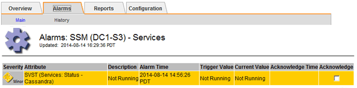
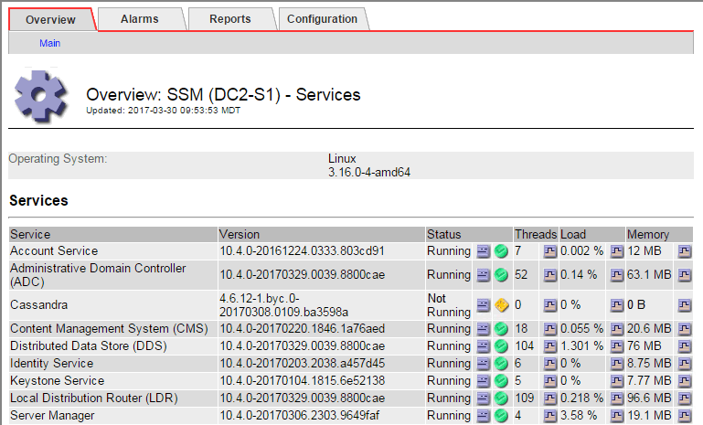

= Risolvere i problemi relativi ai metadati
:allow-uri-read: 
:icons: font
:imagesdir: ../media/

[role="lead"]
È possibile eseguire diverse attività per determinare l'origine dei problemi relativi ai metadati.

== Avviso di spazio di archiviazione dei metadati insufficiente

Se viene attivato l'avviso *Low metadata storage*, è necessario aggiungere nuovi nodi di storage.

.Prima di iniziare
* Hai effettuato l'accesso a Grid Manager utilizzando un link:../admin/web-browser-requirements.html["browser web supportato"].

.A proposito di questa attività
StorageGRID riserva una certa quantità di spazio sul volume 0 di ciascun nodo di storage per i metadati dell'oggetto. Questo spazio è noto come spazio riservato effettivo e viene suddiviso nello spazio consentito per i metadati dell'oggetto (lo spazio consentito per i metadati) e nello spazio richiesto per le operazioni essenziali del database, come la compattazione e la riparazione. Lo spazio consentito per i metadati regola la capacità complessiva degli oggetti.

image::../media/metadata_allowed_space_volume_0.png[Volume spazio consentito metadati 0]

Se i metadati degli oggetti consumano più del 100% dello spazio consentito per i metadati, le operazioni del database non possono essere eseguite in modo efficiente e si verificano errori.

È possibile link:../monitor/monitoring-storage-capacity.html#monitor-object-metadata-capacity-for-each-storage-node["Monitorare la capacità dei metadati degli oggetti per ciascun nodo di storage"] per aiutarti a prevenire gli errori e correggerli prima che si verifichino.

StorageGRID utilizza la seguente metrica Prometheus per misurare la quantità di spazio consentito per i metadati:

[listing]
----
storagegrid_storage_utilization_metadata_bytes/storagegrid_storage_utilization_metadata_allowed_bytes
----
Quando l'espressione Prometheus raggiunge determinate soglie, viene attivato l'avviso *Low metadata storage*.

* *Minore*: I metadati degli oggetti utilizzano almeno il 70% dello spazio consentito per i metadati. È necessario aggiungere nuovi nodi di storage il prima possibile.
* *Major*: I metadati degli oggetti utilizzano almeno il 90% dello spazio consentito per i metadati. È necessario aggiungere immediatamente nuovi nodi di storage.
+

CAUTION: Quando i metadati dell'oggetto utilizzano almeno il 90% dello spazio consentito per i metadati, viene visualizzato un avviso sul dashboard. Se viene visualizzato questo avviso, è necessario aggiungere immediatamente nuovi nodi di storage. Non è mai necessario consentire ai metadati degli oggetti di utilizzare più del 100% dello spazio consentito.

* *Critico*: I metadati degli oggetti utilizzano almeno il 100% dello spazio consentito e stanno iniziando a consumare lo spazio necessario per le operazioni essenziali del database. È necessario interrompere l'acquisizione di nuovi oggetti e aggiungere immediatamente nuovi nodi di storage.

Nell'esempio seguente, i metadati degli oggetti utilizzano oltre il 100% dello spazio consentito per i metadati. Si tratta di una situazione critica, che può causare errori e operazioni inefficienti del database.

image::../media/cdlp_dashboard_alarm.gif[Allarme dashboard metadati]

CAUTION: Se la dimensione del volume 0 è inferiore all'opzione di storage Metadata Reserved Space (ad esempio, in un ambiente non in produzione), il calcolo dell'avviso *Low metadata storage* potrebbe essere impreciso.

.Fasi
. Selezionare *ALERTS* > *current*.
. Dalla tabella degli avvisi, espandere il gruppo di avvisi *Low metadata storage*, se necessario, e selezionare l'avviso specifico che si desidera visualizzare.
. Esaminare i dettagli nella finestra di dialogo degli avvisi.
. Se è stato attivato un avviso importante o critico *Low metadata storage*, eseguire un'espansione per aggiungere immediatamente i nodi di storage.
+

NOTE: Poiché StorageGRID conserva copie complete di tutti i metadati degli oggetti in ogni sito, la capacità dei metadati dell'intera griglia è limitata dalla capacità dei metadati del sito più piccolo. Se devi aggiungere capacità di metadati a un sito, dovresti anche link:../expand/adding-grid-nodes-to-existing-site-or-adding-new-site.html["espandere qualsiasi altro sito"] Dello stesso numero di nodi di storage.

+
Dopo aver eseguito l'espansione, StorageGRID ridistribuisce i metadati degli oggetti esistenti nei nuovi nodi, aumentando così la capacità complessiva dei metadati della griglia. Non è richiesta alcuna azione da parte dell'utente. L'avviso *Low metadata storage* viene cancellato.

== Servizi: Stato - allarme Cassandra (SVST)

L'allarme servizi: Stato - Cassandra (SVST) indica che potrebbe essere necessario ricostruire il database Cassandra per un nodo di storage. Cassandra viene utilizzato come archivio di metadati per StorageGRID.

.Prima di iniziare
* È necessario accedere a Grid Manager utilizzando un link:../admin/web-browser-requirements.html["browser web supportato"].
* Lo hai fatto link:../admin/admin-group-permissions.html["autorizzazioni di accesso specifiche"].
* È necessario disporre di `Passwords.txt` file.

.A proposito di questa attività
Se Cassandra viene arrestato per più di 15 giorni (ad esempio, il nodo di storage viene spento), Cassandra non si avvia quando il nodo viene riportato in linea. È necessario ricostruire il database Cassandra per il servizio DDS interessato.

È possibile link:../monitor/running-diagnostics.html["eseguire la diagnostica"] per ottenere ulteriori informazioni sullo stato corrente della griglia.

CAUTION: Se due o più servizi di database Cassandra rimangono inutilizzati per più di 15 giorni, contattare il supporto tecnico e non procedere con la procedura riportata di seguito.

.Fasi
. Selezionare *SUPPORT* > *Tools* > *Grid topology*.
. Selezionare *_Site_* > *_Storage Node_* > *SSM* > *Services* > *Alarms* > *Main* per visualizzare gli allarmi.
+
Questo esempio mostra che l'allarme SVST è stato attivato.

+

+
La pagina principale dei servizi SSM indica inoltre che Cassandra non è in esecuzione.

+

. [[restart_Cassandra_from_the_Storage_Node]]prova a riavviare Cassandra dal nodo di storage:
+
.. Accedere al nodo Grid:
+
... Immettere il seguente comando: `ssh admin@grid_node_IP`
... Immettere la password elencata in `Passwords.txt` file.
... Immettere il seguente comando per passare a root: `su -`
... Immettere la password elencata in `Passwords.txt` file.
Una volta effettuato l'accesso come root, il prompt cambia da `$` a. `#`.

.. Inserire: `/etc/init.d/cassandra status`
.. Se Cassandra non è in esecuzione, riavviarlo: `/etc/init.d/cassandra restart`

. Se Cassandra non si riavvia, determinare per quanto tempo Cassandra è rimasto inattivo. Se Cassandra è rimasto inattivo per più di 15 giorni, è necessario ricostruire il database Cassandra.
+

CAUTION: Se due o più servizi di database Cassandra non sono disponibili, contattare il supporto tecnico e non procedere con la procedura riportata di seguito.

+
È possibile determinare per quanto tempo Cassandra è rimasta inattiva, inserendolo nella cartella o esaminando il file servermanager.log.

. Per inserire il grafico Cassandra:
+
.. Selezionare *SUPPORT* > *Tools* > *Grid topology*. Quindi selezionare *_Site_* > *_Storage Node_* > *SSM* > *servizi* > *Report* > *grafici*.
.. Selezionare *attributo* > *Servizio: Stato - Cassandra*.
.. Per *Data di inizio*, immettere una data che sia almeno 16 giorni prima della data corrente. Per *Data di fine*, inserire la data corrente.
.. Fare clic su *Aggiorna*.
.. Se il grafico mostra Cassandra come inattivo per più di 15 giorni, ricostruire il database Cassandra.
+
L'esempio seguente mostra che Cassandra è rimasta inattiva per almeno 17 giorni.

+
image::../media/cassandra_not_running_chart.png[Panoramica: SSM: Pagina dei servizi]

. Per esaminare il file servermanager.log sul nodo di storage:
+
.. Accedere al nodo Grid:
+
... Immettere il seguente comando: `ssh admin@grid_node_IP`
... Immettere la password elencata in `Passwords.txt` file.
... Immettere il seguente comando per passare a root: `su -`
... Immettere la password elencata in `Passwords.txt` file.
Una volta effettuato l'accesso come root, il prompt cambia da `$` a. `#`.

.. Inserire: `cat /var/local/log/servermanager.log`
+
Viene visualizzato il contenuto del file servermanager.log.

+
Se Cassandra rimane inattivo per più di 15 giorni, nel file servermanager.log viene visualizzato il seguente messaggio:

+
[listing]
----
"2014-08-14 21:01:35 +0000 | cassandra | cassandra not
started because it has been offline for longer than
its 15 day grace period - rebuild cassandra
----
.. Assicurarsi che la data e l'ora del messaggio siano quelle in cui si è tentato di riavviare Cassandra, come indicato al punto <<restart_Cassandra_from_the_Storage_Node,Riavviare Cassandra dal nodo di storage>>.
+
Per Cassandra possono essere presenti più voci; è necessario individuare la voce più recente.

.. Se Cassandra è rimasto inattivo per più di 15 giorni, è necessario ricostruire il database Cassandra.
+
Per istruzioni, vedere link:../maintain/recovering-storage-node-that-has-been-down-more-than-15-days.html["Recovery Storage Node Down per più di 15 giorni"].

.. Contattare il supporto tecnico se gli allarmi non vengono disattivati dopo la ricostruzione di Cassandra.

== Errori di memoria esaurita di Cassandra (allarme SMTT)

Un allarme SMTT (Total Events) viene attivato quando il database Cassandra presenta un errore di memoria esaurita. Se si verifica questo errore, contattare il supporto tecnico per risolvere il problema.

.A proposito di questa attività
Se si verifica un errore di memoria insufficiente per il database Cassandra, viene creato un dump heap, viene attivato un allarme SMTT (Total Events) e il conteggio degli errori Cassandra Heap out of Memory viene incrementato di uno.

.Fasi
. Guarda l'evento:
+
.. Selezionare *SUPPORT* > *Tools* > *Grid topology*.
.. Espandi il sito, quindi seleziona *_grid_node_*.
.. Selezionare *SSM*, quindi selezionare *Eventi* > *Configurazione*.

. Verificare che il conteggio degli errori di memoria esaurita di Cassandra sia pari o superiore a 1.
+
È possibile link:../monitor/running-diagnostics.html["eseguire la diagnostica"] per ottenere ulteriori informazioni sullo stato corrente della griglia.

. Accedi al nodo selezionato come "admin" tramite SSH e passa all'utente root locale.
. Passare a. `/var/local/core/`, comprimere `Cassandra.hprof` e inviarla al supporto tecnico.
. Eseguire un backup di `Cassandra.hprof` ed eliminarlo da `/var/local/core/ directory`.
+
Questo file può avere una dimensione massima di 24 GB, quindi è necessario rimuoverlo per liberare spazio.

. Una volta risolto il problema, selezionare la casella di controllo *Reset* (Ripristina) per il conteggio degli errori Cassandra Heap out of Memory (heap Cassandra fuori memoria). Quindi selezionare *Apply Changes* (Applica modifiche).
+

NOTE: Per reimpostare i conteggi degli eventi, è necessario disporre dell'autorizzazione di configurazione della pagina topologia griglia.

